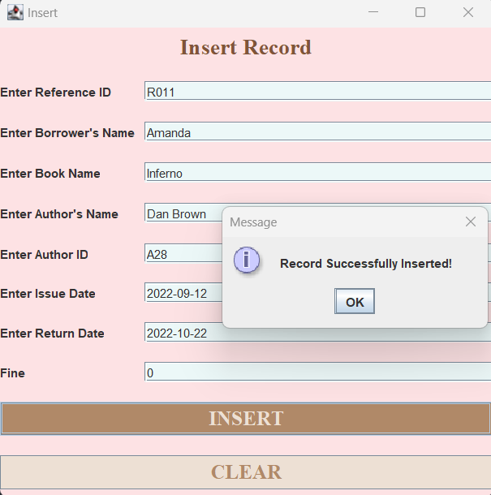
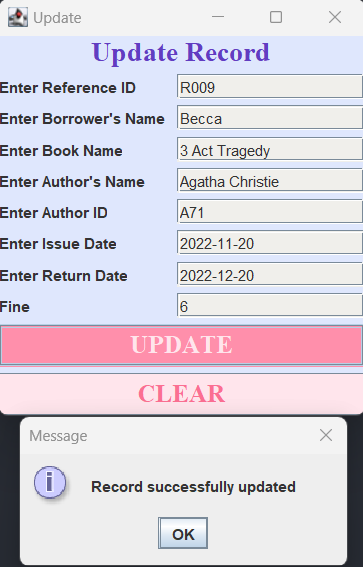
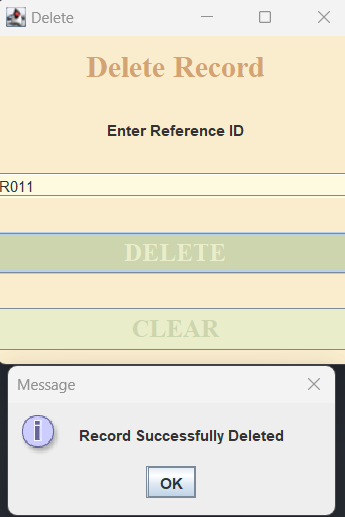
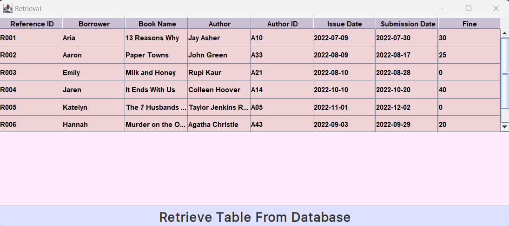

# Libray-Management-System 📚🔖
A Library Management System GUI made using Java Swing UI. This Application aims at easing up the Record-Maintainence task at Libraries.

## Modules Used:
- Swing UI
- SQL

## Methodology
The GUI is linked to the mySql database where the actual records are stored. Using the interface, a user can easily do tasks such as Inserting new records, Updating existing records, deleting the records and Retrieving the data from the table. This eases up the process of having to write the sql queries manually.

#### Inserting Records:

#### Updating:

#### Deleting:

#### Retrieving:

